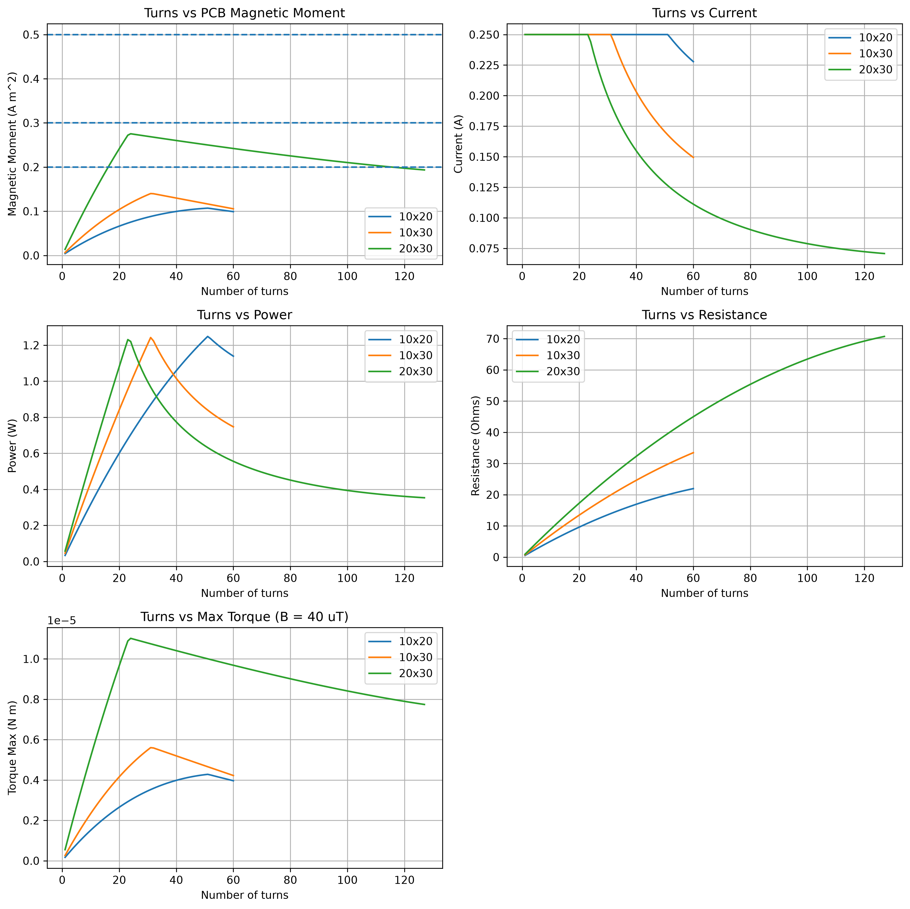

# lioness-magnetorquer
Simulations for magnetorquer PCB

## Simulation Results
Most important note is that the power draw results depend on the max current set. For this plot it is 0.25A, but should be edited based on power draw requirements which will change the number of loops we should go for for each face. Also for each face we should probably go by the dimension of the solar panel instead of the actual 10x20x30 6U setup. Due to the cost of commercial rods, using PCB Magnetorquers on the faces of Lioness seems more promising.

## KiCad Genereated PCBs

